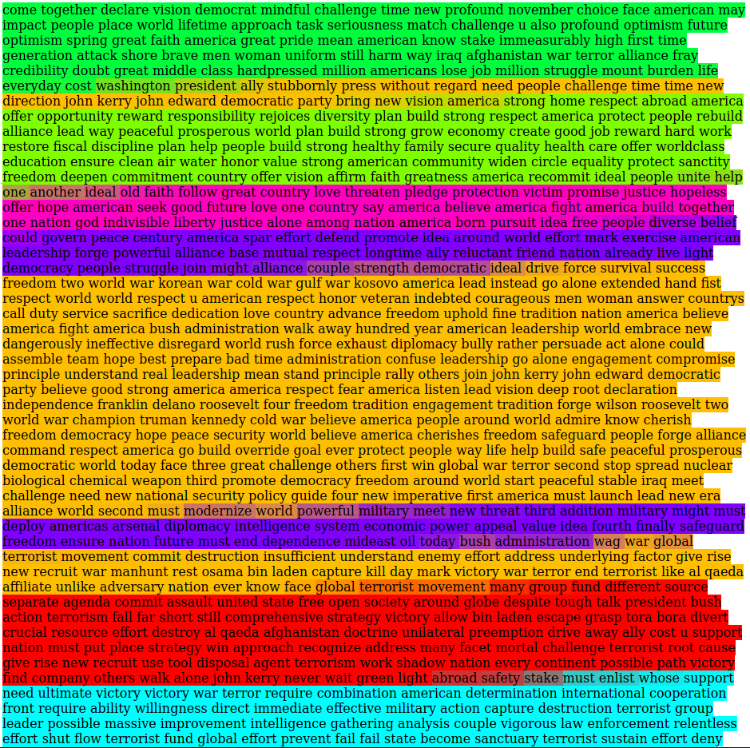

# Spatial methods applied to text : Autocorrelation indices and Fuzzy Topic Clustering

Useful links :

  - Article comparing word similarities coming from WordNet and from Word Embeddings : 
    https://www.caroycuervo.gov.co/documentos/imagenes/word2set-preprint.pdf
    
  - Example of an article about Topic segmentation :
    https://www.sciencedirect.com/science/article/pii/S0306457310000981
    
  - Frequences dans wordnet : https://wordnet.princeton.edu/documentation/cntlist5wn

  - Dictionnaire Electronique des Synonymes (DES) : https://crisco2.unicaen.fr/des/synonymes/synonyme

  - Word sense desambiguation : 
      https://github.com/getalp/disambiguate
      
  - Pretrained Embeddings from Wikipedia (in different languages) : 
    https://wikipedia2vec.github.io/wikipedia2vec/pretrained