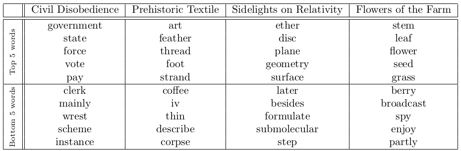

# A general framework for spatial clustering of textual objects: applications in topic clustering and text segmentation

Welcome to the GitHub repository for the (upcoming) article 
*A general framework for spatial clustering of textual objects: applications in topic clustering and text segmentation*.

### Abstract 

We present a general, classical, framework of spatial clustering which can be applied to various textual objects (e.g. character n-grams, words, sentences). This framework proposes to cluster objects according to users defined linguistic similarity, while keeping a spatial coherence of objects among clusters. Two methods are derived from this formalism: SpatialWord, which applies on word-tokens, and SpatialSent, operating on sentences, which both balance between semantic similarities of objects and their position along the textual sequence. We show that these unsupervised methods, along with semi-supervised variants, can perform jointly two operations often achieved individually by methods in literature: (1) the extraction of a desirable number of topics from a document along with list of words to interpret them; and (2) the textual segmentation of the document reflecting these extracted topics. Case studies show that these methods perform competitively against state-of-the-art methods on baseline datasets.

### Some Results

#### Clustering results, with different hyperparameters, on a *Manifesto project* (https://manifesto-project.wzb.eu/) file.

#### Local semantic autocorrelation of tokens of *Flower of the Farms* corpus according to GloVe semantic similarity.

#### Top 5 (and Bottom 5) words with highest (lowest) cumulative local semantic autocorrelation for 4 gutenberg books.

#### Fuzzy Topic Clustering results on a *Manifesto project* file (Republican Party 2004)

#### Top 10 types for each cluster sorted by mean membership on a *Manifesto project* file (Republican Party 2004)

### Organisation of this page

This page is organised as followed :

* In the *code_python* folder lies the code which allows to produce results found in the article. There is another 
  README.md inside this folder detailing the code. Perhaps the most important script is 
  **local_functions.py**, which contains documented functions aimed to be reused.

* In the *corpora* folder, you will find all corpora used during experiments, with raw versions and preprocessed 
  versions.

* The *results* folder contains all the results found in the article (and more).

* Finally, the *similartities_frequencies* folder contains computed similarity matrices and word frequencies obtained
  from corpora. This is by far the heaviest folder of this repository and is only useful for the tested corpora 
  (omit it if you work on your own corpora).
  
### Useful links

#### Corpora 

* Project Gutenberg : www.gutenberg.org
* Manifesto Project : https://manifesto-project.wzb.eu/,

#### Pretrained Word Embeddings

* Pretrained Embeddings from Wikipedia (in different languages) : 
  https://wikipedia2vec.github.io/wikipedia2vec/pretrained
  
* GloVe Word Embeddings : https://nlp.stanford.edu/projects/glove/

#### Related articles (a full bibliography can be found in the article)

* SECTOR Topic classification method :
  https://direct.mit.edu/tacl/article/doi/10.1162/tacl_a_00261/43514/SECTOR-A-Neural-Model-for-Coherent-Topic

* Article comparing word similarities coming from WordNet and from Word Embeddings : 
  https://www.caroycuervo.gov.co/documentos/imagenes/word2set-preprint.pdf
  
* Example of an article about Topic segmentation : 
  https://www.sciencedirect.com/science/article/pii/S0306457310000981
  
