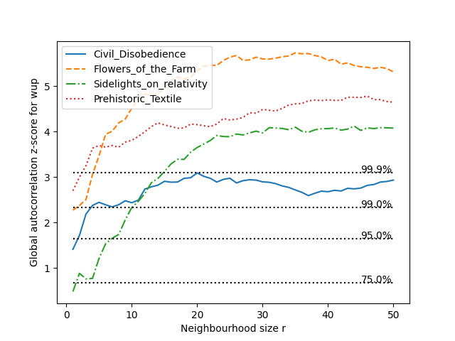
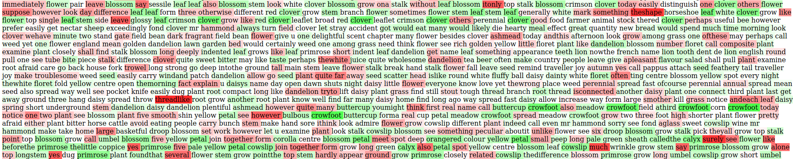
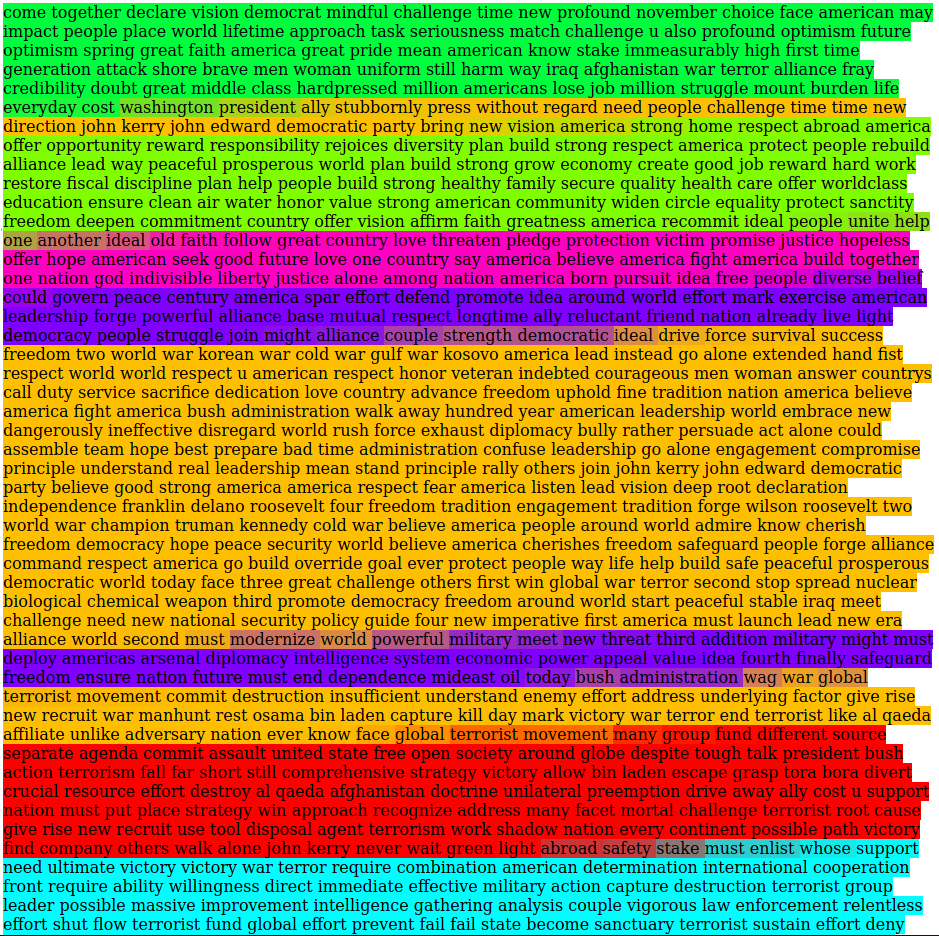
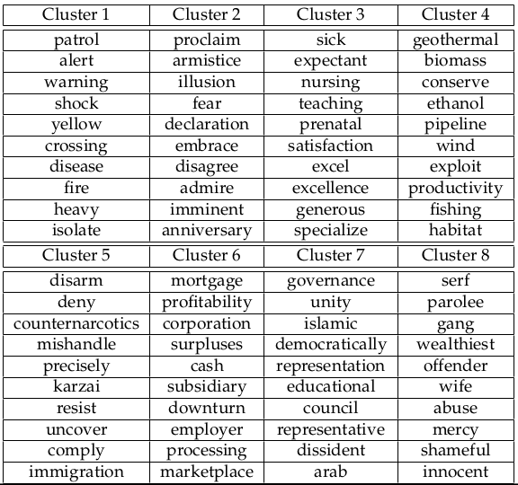

# Spatial methods applied to text : Autocorrelation indices and Fuzzy Topic Clustering

Welcome to the GitHub repository for the (upcoming) article 
*Spatial methods applied to text : Autocorrelation indices and Fuzzy Topic Clustering*.

### Abstract 

This paper presents a general formalism, originated from spatial statistics, which systematically combines two different aspects of tokens found in a text: their **semantic similarities** and their **position** relatively to each others. Uniting these two elements through a classical data analytic formalism yields textual autocorrelation indices of direct relevance for clustering: the **global autocorrelation index** indicates if, overall, semantically similar tokens lies in the same textual neighborhood; the **local autocorrelation index**, referring to each token, indicates if the token semantically contrasted within its vicinity. This formalism also provides a **fuzzy tokens clustering** algorithm, where resulting clusters contain a mixture of semantically and spatially similar tokens. This method, while close to **Topic Modeling** or **Topic Segmentation** approaches, differs from them as it assigns a probability of topic to each tokens, while preserving a spatial coherence between topics, all of this in a unsupervised fashion. It demonstrates promising results on artificial and real-life corpora and provides an new way to extract topics from a document, hence the name **Fuzzy Topic Clustering**.

### Result examples

#### Standardized values of the Global Autocorrelation index vs distance between tokens according to the *Wu-Palmer semantic similarity*

#### Local semantic autocorrelation of tokens of *Flower of the Farms* corpus according to GloVe semantic similarity.

#### Fuzzy Topic Clustering results on a *Manifesto project* file (Republican Party 2004)

#### Top 10 types for each cluster sorted by mean membership on a *Manifesto project* file (Republican Party 2004)

### Organisation of this page

This page is organised as followed :

* In the *code_python* folder lies the code which allows to produce results found in the article. There is another 
  README.md inside this folder detailing the code. Perhaps the most important script is 
  **local_functions.py**, which contains documented functions aimed to be reused.

* In the *corpora* folder, you will find all corpora used during experiments, with raw versions and preprocessed 
  versions.

* The *results* folder contains all the results found in the article (and more).

* Finally, the *similartities_frequencies* folder contains computed similarity matrices and word frequencies obtained
  from corpora. This is by far the heaviest folder of this repository and is only useful for the tested corpora 
  (omit it if you work on your own corpora).
  
### Useful links

#### Corpora 

* Project Gutenberg : www.gutenberg.org
* Manifesto Project : https://manifesto-project.wzb.eu/,

#### Pretrained Word Embeddings

* Pretrained Embeddings from Wikipedia (in different languages) : 
  https://wikipedia2vec.github.io/wikipedia2vec/pretrained
  
* GloVe Word Embeddings : https://nlp.stanford.edu/projects/glove/

#### Related articles (a full bibliography can be found in the article)

* SECTOR Topic classification method :
  https://direct.mit.edu/tacl/article/doi/10.1162/tacl_a_00261/43514/SECTOR-A-Neural-Model-for-Coherent-Topic

* Article comparing word similarities coming from WordNet and from Word Embeddings : 
  https://www.caroycuervo.gov.co/documentos/imagenes/word2set-preprint.pdf
  
* Example of an article about Topic segmentation : 
  https://www.sciencedirect.com/science/article/pii/S0306457310000981
  
