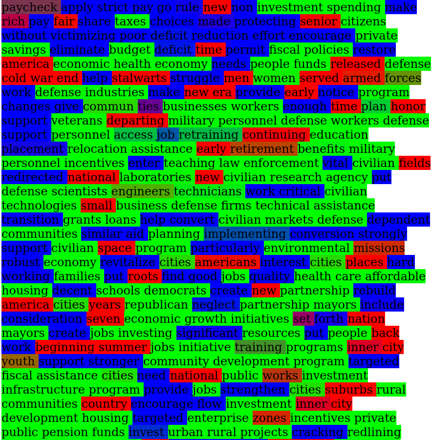
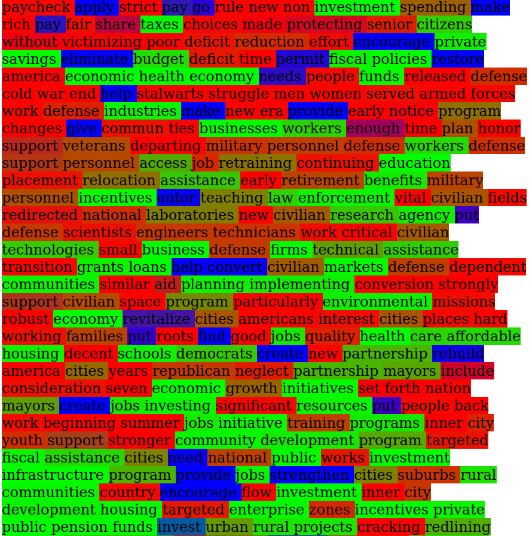
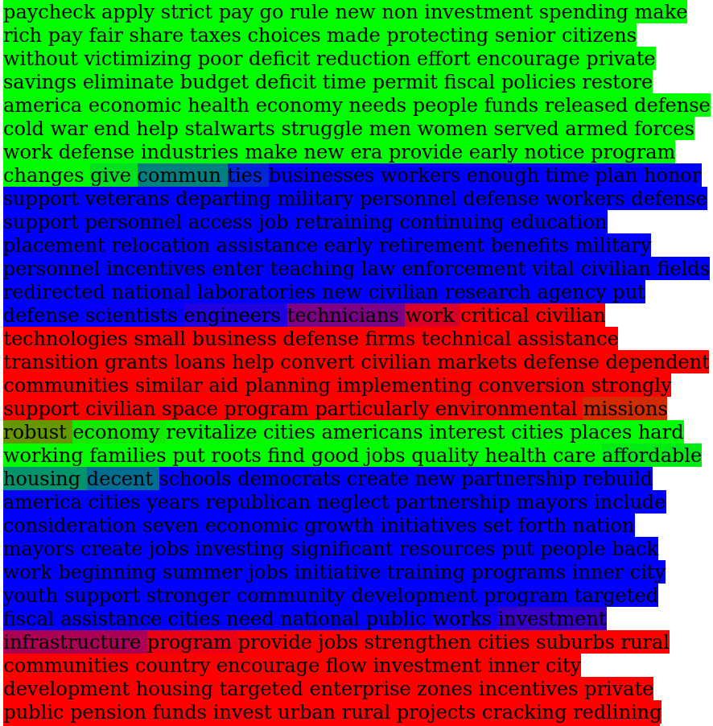
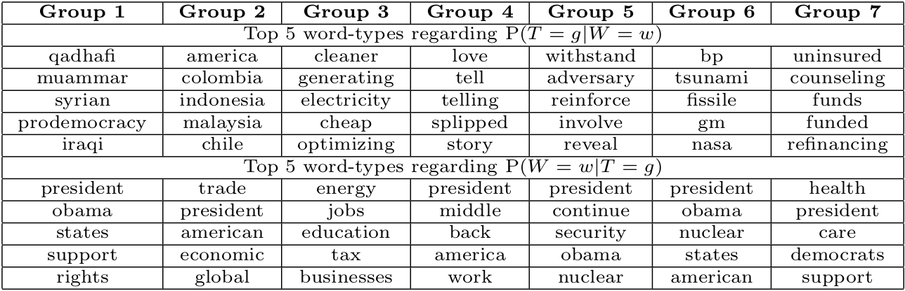
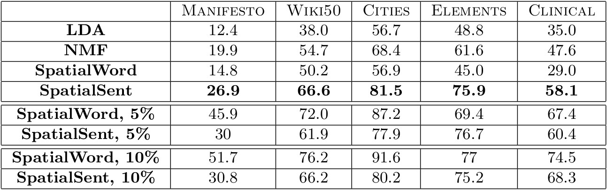
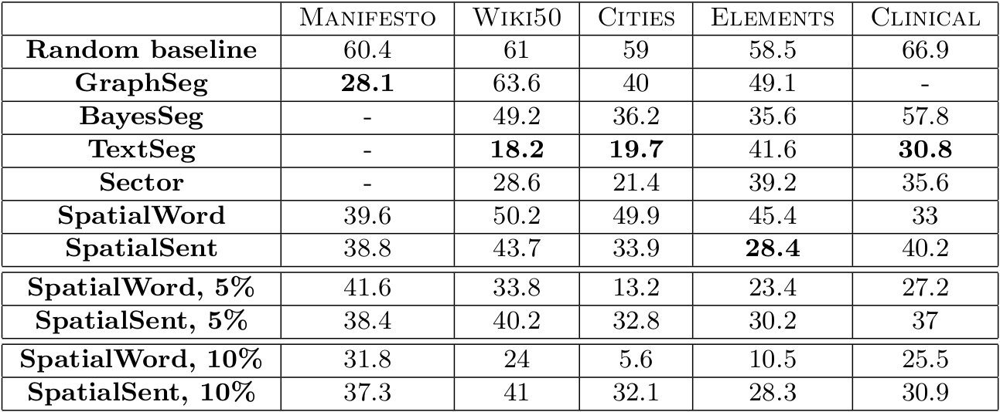

# A general framework for spatial clustering of textual objects: applications in topic clustering and text segmentation

Welcome to the GitHub repository for the (upcoming) article 
*A general framework for spatial clustering of textual objects: applications in topic clustering and text segmentation*.

### Abstract 

We present a general, classical, framework of spatial clustering which can be applied to various textual objects (e.g. 
character n-grams, words, sentences). This framework proposes to cluster objects according to users defined linguistic 
similarity, while keeping a spatial coherence of objects among clusters. Two methods are derived from this formalism: 
SpatialWord, which applies on word-tokens, and SpatialSent, operating on sentences, which both balance between semantic 
similarities of objects and their position along the textual sequence. We show that these unsupervised methods, along 
with semi-supervised variants, can perform jointly two operations often achieved individually by methods in literature: 
(1) the extraction of a desirable number of topics from a document along with list of words to interpret them; and 
(2) the textual segmentation of the document reflecting these extracted topics. Case studies show that these methods 
perform competitively against state-of-the-art methods on baseline datasets.

### Quick start guide 

This guide will help you to make a simple sentences clustering of text found in `Democrat_1992.csv`, using functions 
found in the `local_functions.py` file. The main result is a *membership matrix*, containing fuzzy group memberships 
for each textual object, in this case, sentences. This can be used to create a html file coloring the sentences of the 
text. The source code of this guide can be found in the file `Clustering_segmentation_example.py`. 

First, make sure you have the `Democrat_1992.csv` and `local_functions.py` files in your local folder., and the file in 
the same folder. Required libraries must then be installed (a virtual environment is recommended)
```
pip3 install -r requirement.txt
```
Launch python
```
python3
```
Load libraries and functions
```{python}
from local_functions import *
import pandas as pd
import numpy as np
from sentence_transformers import SentenceTransformer, util
```
We first load the corpus (which is found in csv format) and get all sentences in a list
```{python}
democrat_1992 = pd.read_csv("Democrat_1992.csv")
sentences = list(democrat_1992["text"])
```
The `all-mpnet-base-v2` model of sentence embedding (https://huggingface.co/sentence-transformers/all-mpnet-base-v2) 
is loaded and cosine similarities between sentences are constructed 
```{python}
sbert_model = SentenceTransformer("all-mpnet-base-v2")
sentence_embeddings = sbert_model.encode(sentences)
sim_mat = np.array(util.pytorch_cos_sim(sentence_embeddings, sentence_embeddings))
```
We now use functions found in `local_functions.py` to: (1) build a dissimilarity matrix, (2) build an exchange matrix, 
(3) run the fuzzy clustering function. The final results can be found in `membership_matrix` variable. Recommended 
hyperparameters can be found in the article.
```{python}
d_mat = similarity_to_dissimilarity(sim_mat)
exch_mat, w_mat = exchange_and_transition_matrices(len(sentences), exch_mat_opt="u", exch_range=5)
membership_matrix = spatial_clustering(d_ext_mat=d_mat, exch_mat=exch_mat, w_mat=w_mat, n_groups=6,
                                       alpha=10, beta=100, kappa=0.75, verbose=True)
```
The results can be used to compute various indices, but we can save them as well in a html file to represent groups as 
text coloration
```{python}
write_groups_in_html_file("Democrat_1992_results.html", sentences, membership_matrix)
```
You can fine additional, documented functions in the `local_functions.py` file, allowing the clustering on preprocessed 
text files at the token level. Read docstrings to use these functions.

### Some Results

#### Clustering results, with different hyperparameters, on a file from the *Manifesto project* (https://manifesto-project.wzb.eu/)

<p>



</p>

#### Word-types representative of found groups in a *Manifesto project* file

<p>

</p>

#### Topic clustering results, indicated with Normalised Mutual Information (higher is better) score compared to Latent Dirichlet Allocation (LDA) and Non-negative Matrix Factorization  (NMF)

<p>

</p>


#### Text segmentation results, indicated with Pk score (lower is better) compared to state-of-the-art methods

<p align="center">

</p>

### Organisation of this page

- All functions needed to run algorithms, compute statistics, and more are found in the `local_functions.py` 
script. These functions are documented by docstrings.
- The files `Clustering_segmentation_example.py` contains the example showed in the quick start guide. This example is 
run on the `Democrat_1992.csv` file and results are illustrated in the `Democrat_1992_results.html` file.
- `1_preprocessing_and_utility_scripts` contains scripts to make pre-processing treatments, compute summary 
statistics, and plot graphics.
- `2_hyperparameter_search` contains scripts to tune hyperparmater for different methods
- `3_clustring_or_segmentation_on_folder` contains scripts to run methods on a folder containing 
several files, in order to compute scores on a corpus.
- `4_clustering_or_segmentation_on_file` contains scripts to run methods on a single file, outputting more
statistics and html text coloring results.
- `copora` contains the corpora used in the article.
- `old_scripts` contains previously used scripts, not useful anymore but archived in order to keep the logic used at 
that time.
- `results` contains results showed in the article.
- `similarity_matrices` permit to store pre-computed similarity matrices for a file, allowing to reduce computing time 
when doing hyperparameters tuning. Note that some files, exceeding 100Mo, could not be stored on GitHub.

  
### Useful links

#### Corpora

All corpora used can be found in the `corpora` folder. Original sources are:

* Manifesto Project: https://manifesto-project.wzb.eu/,
* Wiki50: https://www.dropbox.com/sh/k3jh0fjbyr0gw0a/AADzAd9SDTrBnvs1qLCJY5cza?dl=0
* Cities and Elements: http://groups.csail.mit.edu/rbg/code/mallows/
* Clinical: http://groups.csail.mit.edu/rbg/code/bayesseg/

#### Pretrained Word and Sentences Embeddings

All pretrained embeddings used in the article can be found:

* Pretrained Word2Vec embeddings from Wikipedia (in different languages): https://wikipedia2vec.github.io/wikipedia2vec/
  
* GloVe embeddings: https://nlp.stanford.edu/projects/glove/

* FastText embeddings: https://fasttext.cc/docs/en/english-vectors.html

* The *all-mpnet-base-v2* model for sentence embeddings: https://huggingface.co/sentence-transformers/all-mpnet-base-v2) 

#### Related methods (a full bibliography can be found in the article)

The methods compared in the *text segmentation* task are described in the following articles: 

* GraphSeg: https://aclanthology.org/S16-2016.pdf

* BayesSeg: https://aclanthology.org/D08-1035.pdf

* TextSeg: https://arxiv.org/pdf/1803.09337.pdf

* Sector: https://direct.mit.edu/tacl/article/doi/10.1162/tacl_a_00261/43514/SECTOR-A-Neural-Model-for-Coherent-Topic
  
Note that for the *topic clustering* task, the baselines used, i.e. LDA and NMF methods, are well known and can be 
found in multiple python packages.